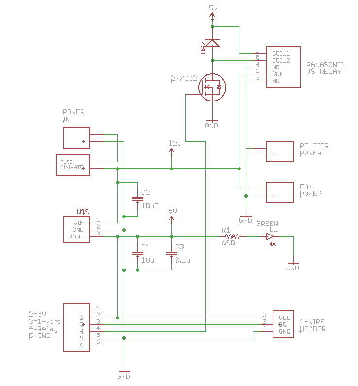

# Wine chiller controller replacement

I have two Edgestar TWR282S thermoelectric wine chillers. One has wine in it, but the other I keep vegetables in, sort of like a root cellar.

They're over 10 years old, and I've been replacing parts on them for a while, but the case and doors are fine and the vegetable one has custom plexiglass shelves in it, so I hesitate to replace it.

I've replaced interior fans, [exterior fans](http://blog.rickk.com/food/2014/12/wine-chiller-exterior-fan-repair.html), and [Peltier chillers](http://blog.rickk.com/food/2013/06/repairing-a-wine-chiller.html), which are all pretty straightforward to do.

I also replaced the [controller boards](http://blog.rickk.com/food/2013/10/repairing-a-wine-chiller-part-2.html), which were available from Edgestar. They were kind of expensive at $48, and apparently not very durable, because one of the 4 year old replacements failed. And they're no longer available.

It appears the inductor failed. I might be able to just replace that but I have a better idea.

I added a new power supply, controller board, and a fancy display that shows the temperature and also communicates the data so I can monitor the temperatures remotely!

The cyan LED to the right of the alphanumeric display turns red when the temperature is out of normal range.

I also get push notifications on my phone if the temperature goes way out of normal range.

## Power Supply

I replaced the power supply with a $14.98 12V 10A switching power supply that I got [from Amazon](https://www.amazon.com/LEDMO-Switching-Converter-Adapter-Transformer/dp/B01E6RMASC/ref=pd_ybh_a_4). It really only needs to be 5 to 6A, but the 10A was reasonably priced and offers a nice safety margin.

I was able to use the existing power cord, and I just replaced the connector with two spade lugs for connecting to the power supply. I also moved it from above the Peltier heat sink to the side, so hot air is not constantly blowing across it. The old location really seems suboptimal.

## Power Board

I made a power/controller board as well. It has a power supply for the display board, a bunch of handy connectors, a fuse, and a relay. 

In practice the Peltier is always on in my experience, but I did add a relay so it could be turned off in software, based on the thermometer reading inside the chiller. This allows for temperature control, and would also save some energy, as the Peltier by far uses the most energy, about 48 watts.
 

 
This is the controller board with the 7 SMD components soldered to the board.

And with all of the through-hole components soldered on.

Installed in the chiller.

## Temperature sensor

I drilled a hole through the back of the chiller and used a weatherproof DS18B20 temperature sensor [from Amazon](https://www.amazon.com/Hilitchi-DS18B20-Waterproof-Temperature-Sensors/dp/B018KFX5X0/ref=sr_1_5). It was $12.99 for a set of 5 but I only needed 1 for this project.

## Interior connections

Above the temperature sensor is the wiring that goes to the interior control box. There is one connector with 2 red wires and a black. And another connector with a black and yellow.

Connect all of the reds together; these are the +12V to the light and interior fan.

Connect all of the blacks together; these are the GND to the light and interior fan.

The yellow wire is for the temperature control inside; that's not used.

The light switch still works.

## Display board

The display board is mounted on the front of the chiller.

Here's the display board with only the SMD components mounted. These include another DS18B20 temperature sensor (this time a 8-SOIC version) and a 4.7K pull-up resistor (0603 SMD) for the 1-Wire interface.

It also has a NeoPixel (WS2812) programmable LED and a 470 ohm series resistor for the data line (0603 SMD).

And power supply capacitors 0.1uF and 10 uF, and the SMD socket for the Particle Photon.

There are also through-hole connectors for a modular jack and a SSD1306 display.

## Total Materials

This did cost more than the original controller, but it has a lot more features. In reality, you can just buy the power supply and wire it up with wire nuts and a little wire and it would cost maybe $16.

| Item | Source | Price |
|---|---|---|
| Power Supply | [Amazon](https://www.amazon.com/LEDMO-Switching-Converter-Adapter-Transformer/dp/B01E6RMASC/ref=pd_ybh_a_4) | 14.98 |
| Spade Lugs (2) | | $0.201 |
| ChillerPower Board | [OshPark](https://oshpark.com) | $4.902 |
| 2-conductor terminal blocks (3) | [DigiKey](https://www.digikey.com/product-detail/en/on-shore-technology-inc/OSTTF020161/ED2623-ND/614572) | $2.55 |
| 3-conductor terminal block | [DigiKey](https://www.digikey.com/product-detail/en/on-shore-technology-inc/OSTTE030161/ED2636-ND/614585) | $1.00 | 
| Modular Jack | [DigiKey](https://www.digikey.com/product-detail/en/stewart-connector/SS-7066-NF/380-1043-ND/388305) | $0.77 |
| Fuse holder | [DigiKey](https://www.digikey.com/product-detail/en/keystone-electronics/3568/36-3568-ND/2137306) | $0.98 |
| Fuse MiniATC 7.5A |  | $0.761 |
| Capacitor 10 uF 0805 | [DigiKey](https://www.digikey.com/product-detail/en/murata-electronics-north-america/GRM21BR61C106KE15L/490-3886-1-ND/965928) | $0.074 |
| Capacitor 0.1 uF | [DigiKey](https://www.digikey.com/product-detail/en/murata-electronics-north-america/GRM188R71C104KA01D/490-1532-1-ND/587771) | $0.033 |
| Resistor 680 ohm 0805 | [DigiKey](https://www.digikey.com/product-detail/en/panasonic-electronic-components/ERJ-6GEYJ681V/P680ACT-ND/90033) | $0.013 |
| Green LED 0603 | [DigiKey](https://www.digikey.com/product-detail/en/lite-on-inc/LTST-C193KGKT-5A/160-1828-1-ND/2356247) | $0.235 |
| Relay | [DigiKey](https://www.digikey.com/product-detail/en/panasonic-electric-works/JS1-5V-F/255-2064-ND/1242012) | $1.63 |
| Diode BAS21 | [DigiKey](http://www.digikey.com/product-detail/en/BAS21-7-F/BAS21-FDICT-ND/717813) | $0.14 |
| 2N7002 MOSFET | [DigiKey](https://www.digikey.com/product-detail/en/on-semiconductor/2N7002LT3G/2N7002LT3GOSCT-ND/2704932) | $0.16 |
| R-78-E Regulator | [DigiKey](https://www.digikey.com/product-detail/en/recom-power/R-78E5.0-0.5/945-1648-5-ND/2834904) | $2.84 |
| DS18B20 Weatherproof | [Amazon](https://www.amazon.com/Hilitchi-DS18B20-Waterproof-Temperature-Sensors/dp/B018KFX5X0/ref=sr_1_5) | $2.996 |
| ChillerDisplay Board | [OshPark](https://oshpark.com) | $8.318 |
| Photon Headers (2) | [DigiKey](https://www.digikey.com/product-detail/en/sullins-connector-solutions/NPTC121KFXC-RC/S5604-ND/776062) | $3.38 |
| Particle Photon | [Amazon](https://www.amazon.com/Particle-PHOTON-Comprehensive-Development-Access/dp/B016YNU1A0/ref=pd_ybh_a_5) | $19.00 | 
| NeoPixel | [DigiKey](https://www.digikey.com/product-detail/en/adafruit-industries-llc/1655/1528-1104-ND/5154679) | $0.457 |
| SSD1306 Display | [eBay](https://www.ebay.com/itm/391742247377) | $5.45 |
| Resistor 470 ohm | [DigiKey](https://www.digikey.com/product-detail/en/panasonic-electronic-components/ERJ-3GEYJ471V/P470GCT-ND/134802) | $0.013 |
| Resistor 4.7K ohm | [DigiKey](https://www.digikey.com/product-detail/en/panasonic-electronic-components/ERJ-PA3J472V/P4.7KBZCT-ND/5036332) | $0.013 |
| Capacitor 10 uF 0805 | [DigiKey](https://www.digikey.com/product-detail/en/murata-electronics-north-america/GRM21BR61C106KE15L/490-3886-1-ND/965928) | $0.074 |
| Capacitor 0.1 uF | [DigiKey](https://www.digikey.com/product-detail/en/murata-electronics-north-america/GRM188R71C104KA01D/490-1532-1-ND/587771) | $0.033 |
| Modular Jack | [DigiKey](https://www.digikey.com/product-detail/en/stewart-connector/SS-7066-NF/380-1043-ND/388305) | $0.77 |
| Wire Nuts (gray) |  | $0.501 |
| Hook-up Wire 18ga |  | $0.501 |
| Modular cable (4 conductor) |  | $2.001 |

Total: $72.72

1I had these on hand, I just guessed the price.

2The ChillerPower board has a minimum order of 3 at OshPark, so the actual cost was $14.70.

3I bought these in quantity 100 and divided the price. If you bought them in single quantities they'd be around $0.10 each.

4I bought these in quantity 100 and divided the price. If you bought them in single quantities they'd be around $0.21 each.

5I bought these in quantity 25 and divided the price. If you bought them in single quantities they'd be around $0.41 each.

6I bought these in quantity 5 and divided the price. Other vendors sell them in single quantities at a higher price.

7I bought these in quantity 10 and divided the price. That's the smallest package they're sold in.

8The ChillerDisplay board has a minimum order of 3 at OshPark, so the actual cost was $24.95.

## Firmware

I haven't included the firmware for the Photon. It's a simple matter of programming. No really, it uses standard libraries for the DS18B20 and SSD1306 and it should't be complicated.

The problem is that my code relies on a bunch of server infrastructure that's too complicated to share, and I didn't feel like writing a new set of firmware just for this post that I'd never use. I may change my mind later.
